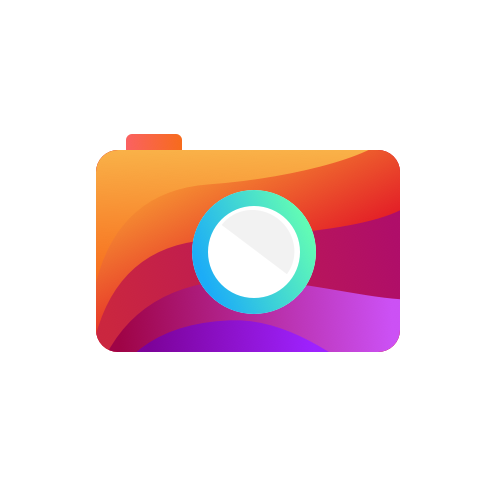
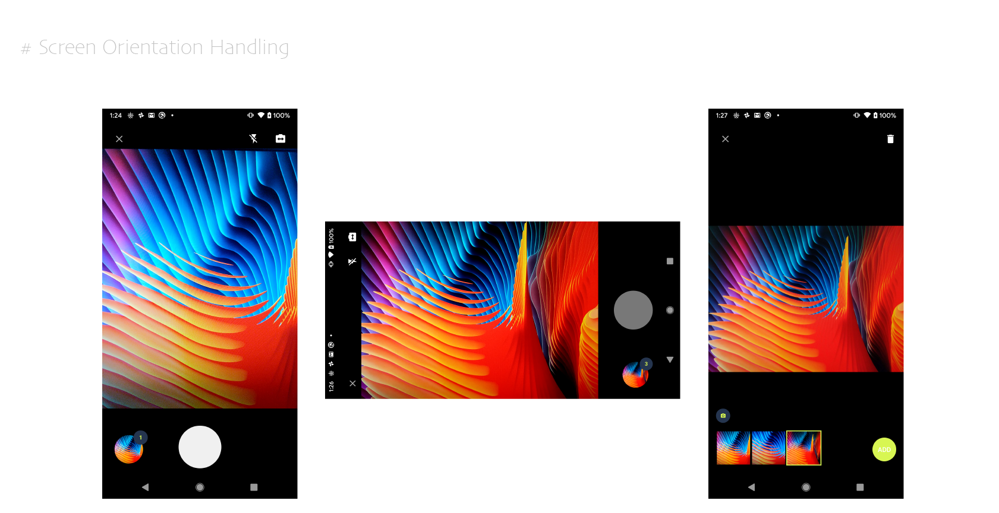

## EasyCam

We have developed this module while working on one of our project



### How to use
1. Add dependency in module gradle file  `implementation 'in.balakrishnan.easycam:easycam:0.0.2'` 
2. Start the Intent when required from activity or fragment 

        Intent intent = new Intent(this, CameraControllerActivity.class);
        intent.setFlags(Intent.FLAG_ACTIVITY_SINGLE_TOP | Intent.FLAG_ACTIVITY_CLEAR_TOP);
        intent.putExtra("inputData", new CameraBundleBuilder()
                .setFullscreenMode(false)
                .setDoneButtonString("Add")
                .setSinglePhotoMode(false)
                .setMax_photo(3)
                .setManualFocus(true)
                .setBucketName(getClass().getName())
                .setPreviewEnableCount(true)
                .setPreviewIconVisiblity(true)
                .setPreviewPageRedirection(true)
                .setEnableDone(false)
                .setClearBucket(true)
                .createCameraBundle());
        startActivityForResult(intent, 214);
  
 3. You will get the results in onActivityResult() callback. 

 
    ```
    @Override
    protected void onActivityResult(int requestCode, int resultCode, @Nullable Intent data) {
        super.onActivityResult(requestCode, resultCode, data);
        if (requestCode == 214) {
            if (resultCode == RESULT_OK) {
                assert data != null;
                list = data.getStringArrayExtra("resultData");
            }
        }
    }
4. Delete the files once you are processed them using following function 
`FileUtils.clearAllFiles(this, getClass().getName());`

The above function requires context and bucket name. 

**What EasyCam offers**
1. Screen orientation handling
2. Output image orientation handling
3. Front and Back cam support
4. Flash support 
5. Single and multiple photo shoot mode
6. Set minimum and maximum count for multiple shoot mode
7. Preview of taken photos
8. Manual focus
9. Live preview in full screen or fit to aspect ratio
10. Delete option in multiple shoot mode  

The standout point in Easy cam is that all components are configurable
(i.e) Capture button drawable, Done button background and text.
 



Also we have thrown in a cool feature that preview badge image will turn
along with the device orientation. We can either enable or disable this. 

#### Change Log
You can see the change log [here](changeLog/ChangeLog.md)

#### Contribution 
Interested to contribute to EasyCam, You are one pull request away. 
You can go through the guidelines [here](CONTRIBUTING.md)

#### Contact 
Reach out to me in [Twitter](https://twitter.com/BalakrishnanPT)


